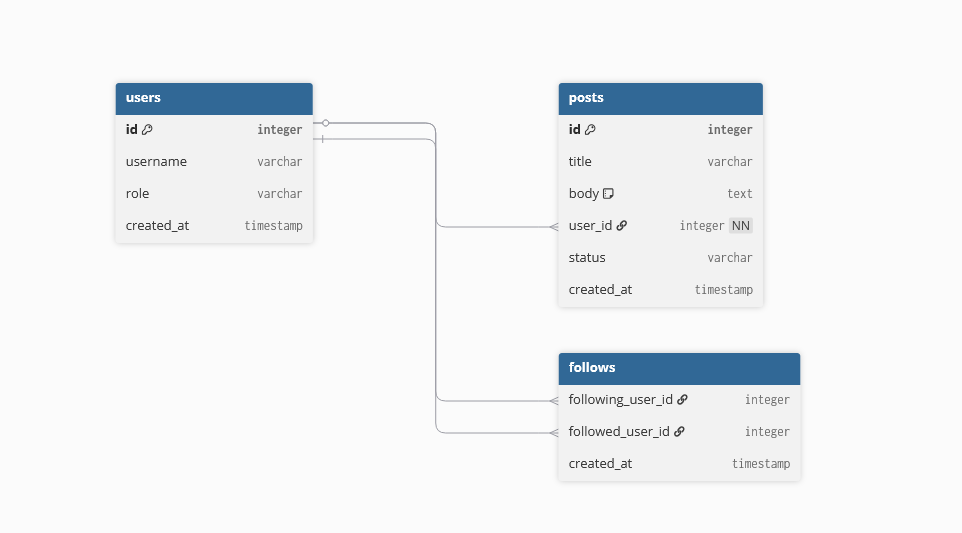
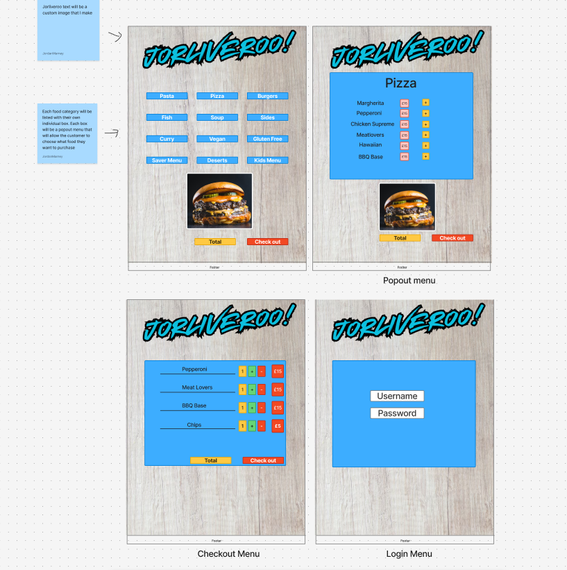
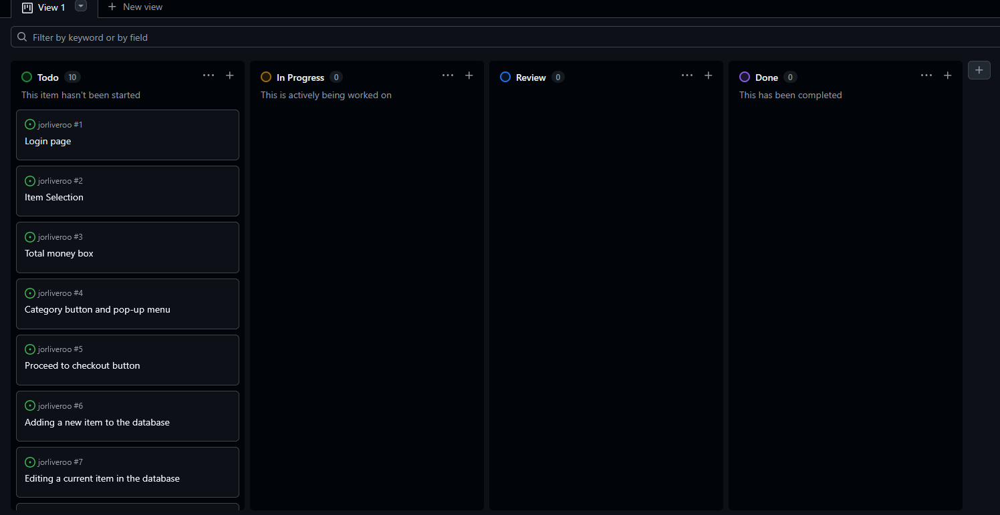
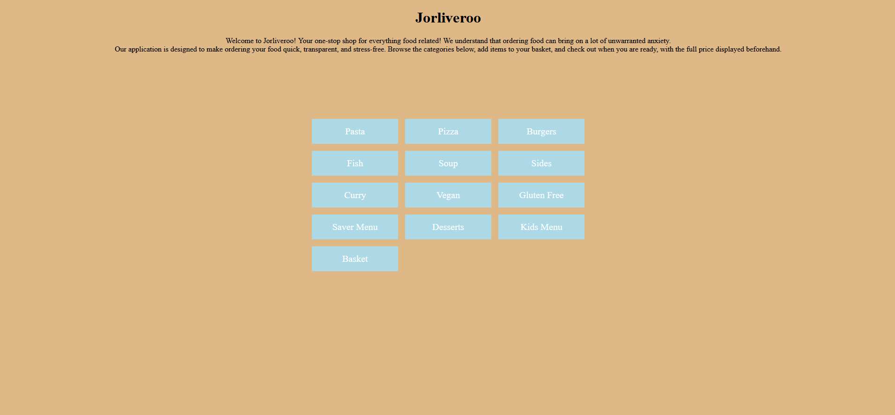
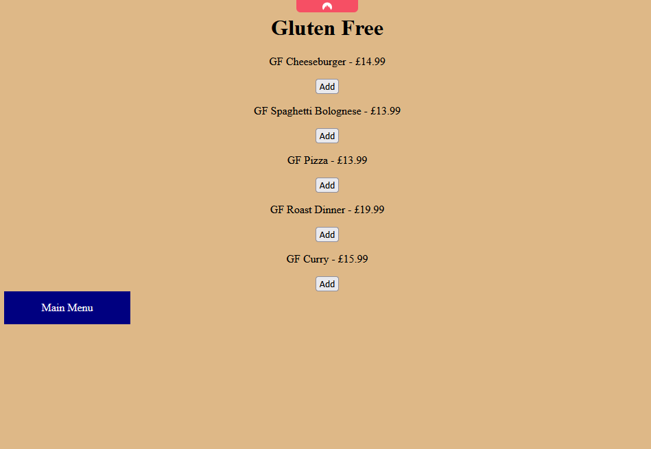
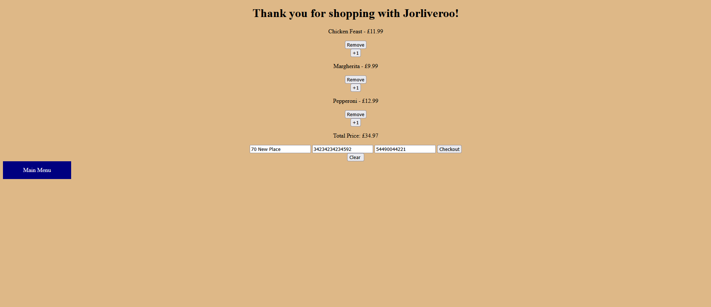
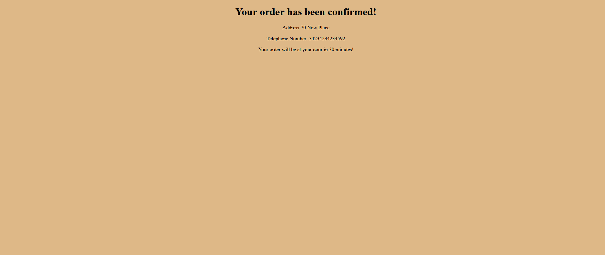

# Jorliveroo

# Table of Contents
- [Introduction](#introduction)
- [User Interactions](#user-interactions)
- [Database Design](#database-design)
- [Entity Relationship Diagram](#relationship-diagram)
- [User Stories](#user-stories)
  - [Item Selection](#item-selection)
  - [Total Money Box](#total-money-box)
  - [Category button and pop-up menu](#category-button-and-pop-up-menu)
  - [Proceed to checkout button](#proceed-to-checkout-button)
  - [Adding a new item to the database](#adding-a-new-item-to-the-database)
  - [Editing a current item in the database](#editing-a-current-item-in-the-database)
  - [Deleting an item from the database](#deleting-an-item-from-the-database)
- [Who was the target audience?](#who-was-the-target-audience)
- [Why my application is easy to use](#why-my-application-is-easy-to-use)
- [User Experience](#user-experience-ux)
- [Application planning](#application-planning)
- [Project Management](#project-management)
- [Features](#features)
- [Administrative features](#administrative-features)
- [Future planning](#future-planning)
- [Application images](#application-images)
- [Validation](#validation)
- [Security Measures](#security)
- [Deployment](#deployment)
- [Testing](#testing)
- [Technologies Used](#technologies-used)
- [Visual Design](#visual-design-and-styling)
- [Navigation](#navigation)
- [Accessibility and Ease of Use](#accessibility-and-ease-of-use)
- [Design and Audience Alignment](#design-and-audience-alignment)
- [Acknowledgements](#acknowledgements)
  
  

## Introduction
Jorliveroo is a web application for users seeking a simplified food ordering experience. Have you been put off by ordering food simply because of the countless pages, tedious advertisements, and hidden fees? With Jorliveroo, I have simplified this experience, stripping away the tedious components that competitors offer. The main menu will host the twelve different categories, each with its own pop-up menu. From there, users will be able to select the items they want to add from that category. At the bottom of the main menu is the total fee including VAT. The application is designed to lower the anxiety challenges one could face when ordering food. Whether that be unsure of the total fee, or put off by the various pages and advertisements, Jorliveroo is here to lower that anxiety. The users will have a unique login so that they can gain access to the application. 
## Why my application is easy to use
My application is easy to use because I have simplified the food ordering system. Instead of multiple tabs, the menus are accessible under one page, with pop-up menus instead of a new page. This will make the application more efficient than its competitors due to its easy-to-use buttons, clear structure, and more. Not only will it be user-friendly through its clear structure, but the buttons will also be clear, color-blind friendly, with font-sizes that are readable on a variety of devices, and a color scheme that matches the core design of the application.
## User interactions 
Here is a full list of interactions that a user can have with my application:
* A user can enter their username and password to log into the application
* A user can click on one of the buttons to open up the respective pop-up menu
* A user can click the plus icon next to the respective item they wish to add to their basket
* A user can view the total price of their basket at the bottom of the main menu page
* A user can proceed to checkout
* A user can add another of the same item currently in their basket
* A user can also remove said item from the basket
* An admin can add items to the database
* An admin can edit the current item names and or price in the database
* An admin can remove one of the existing items from the database
## Database design 
My database will be easily manageable by any administrator who needs to step in at any given time. The database structure is as follows:
* id
* item category
* item name
* item price
## Relationship Diagram
The foundations for the application were designed using a simple entity relationship diagram. The model ensures the food items are put in their respective categories correctly:

### Relationships:
Here is how those relationships above are linked to one another:
* Each food item belongs to a singular category.
* One category will contain multiple food items.
* Food items are linked to categories using a foreign key. 
* Database structure allows administrators to add, edit, and remove items from categories.
## User Stories
The user stories for the Jorliveroo food delivery application were created with MoSCoW methodology in mind. These user stories helped with the application's design, clearly identifying the customer's journey, while also helping the admin team address any required adjustments.
## Login
* **As a user:** Customer
* **I want to be able to**: Login using my username and password.
* **So that**: I can access the food delivery application.
* **Acceptance Criteria**:
  * Simple login validation form that requires only a username and password box. 
  * Once the username and password are entered correctly, users are directed to the main menu.
  * If the password and or username is incorrect, an error message will appear.
## Item selection
* **As a user:** Customer
* **I want to be able to**: Choose from a variety of food items on one page.
* **So that**: I can proceed to checkout at a much quicker pace.
* **Acceptance Criteria**:
  * Button for each category: Pasta, Pizza, Burgers, Fish, Soup, Sides, Curry, Vegan, Gluten Free, Saver Menu, Desserts, and Kids Menu.
  *  The user can order from a variety of food choices.
  *  Button font must be Century Gothic (Body), white text colour, and bold.
## Total money box
* **As a user:** Customer
* **I want to be able to**: See the total number of their basket before proceeding to checkout.
* **So that**: Ensures the figure at the bottom of the page aligns with the budget I had in my head for ordering takeout.
* **Acceptance Criteria**:
     *  Total money box at the bottom of the page.
     *  The user can clearly see the total of their order.
     *  Text must be bold, black, Century Gothic, and 20px.
 ## Category button and pop-up menu  
 * **As a user:** Customer
 * **I want to be able to**: Click on a category button, and the respective menu appears.
 * **So that**: I can decide which of the respective items I want to add to my basket.
 * **Acceptance Criteria**:
    * Pop-up menu for each category.
    * The user can add items from the pop-up menu directly into their basket via the + button next to the item.
    * Menu colour must be blue, price figures box red, "add" box yellow, text size 20 px, and font Century Gothic.
 ## Proceed to checkout button 
 * **As a user:** Customer
 * **I want to be able to**: Proceed to checkout quickly without going through multiple menus to get to the end destination.
 * **So that**: I can proceed with payment and complete my purchase.
 * **Acceptance Criteria**:
    * Button that takes the user directly to the checkout page.
    * The customer's order, including items and their prices, appears on the checkout page, matching the figure displayed on the menu page.
    * Button must be red, the text colour white, font size 20 px, and Century Gothic font.
 ## Adding a new item to the database
 * **As a user:** Admin
 * **I want to be able to**: Add a new food item into one of the categories.
 * **So that**: The food menu is updated to the latest items for the online store.
 * **Acceptance Criteria**:
    * Item is saved in the database.
    * Item must be assigned a price.
    * Item must be assigned a category so that the database knows which category the item belongs to.
 ## Editing a current item in the database
  * **As a user:** Admin
  * **I want to be able to**: Edit one of the existing items in the database.
  * **So that**: The item is up to date with the latest requirements, for example, the price has changed.
  * **Acceptance Criteria**:
     * The edits are saved in the database.
     * The updates are saved and appear on the application.
  ## Deleting an item from the database
   * **As a user:** Admin
   * **I want to be able to**: Delete one of the existing items from the database.
   * **So that**: The item no longer appears in one of the respective menus in the application.
   * **Acceptance Criteria**:
      * The item is removed from the application.
      * The item is removed from the database.
      * The database is saved to reflect the new menu.
## Who was the target audience?
The primary target audience for those using the jorliveroo appplication is those who want to order food from their mobile, but choose not to due to stress or anxiety that other applications offer. Many can be complex, include hidden fees, and take up a lot more time than is needed. Therefore, the app is designed for those:
* Who want a quick service
* Want to know the exact price they need to budget for
* Lower their anxiety when ordering food online

The jorliveroo app is easy to use thanks to the clean, one-page user interface that has every menu accessible on one screen. As noted above, the prices are accurate, allowing for less anxiety and exact knowledge of the price of their order with VAT and delivery fees added onto the price from the beginning. 

## User Experience (UX)
We have all had our bad experiences with delivery applications. Whether they are unable to locate a driver, cancel your order after waiting an hour, or do not tell you the full story when it comes to price. 

The goals for the UX design aimed at keeping the application simple, with clear buttons, readable font sizes, a variety of colours, a navigation system that is very simple to use, and a simple page layout, with no added extras. Transparency is also a key feature when it comes to the price; what you see is what you get, no hidden fees. 

### Accessibility
As mentioned above, the application was designed with accessibility as a core focus:
* Easy to read buttons
* Readable font sizes
* Simple layout
* No clashing colours
* Responsive design that is also suitable for mobile and other devices. 

## Application planning 

### Wireframes 
Before I began the creation of my application, I first needed to design it using wireframes. This gave me the foundations necessary to complete the full build of the application. The wireframes outlined the simplicity of the application, showcasing just how easy it is to navigate the jorliveroo food application. Below you can see the complete wireframes for my app:

## Project Management 

The application was developed using Agile principles, which were handled via GitHub's issues and commitments, so that I can track my progress. From there, I was able to plan each stage of the project:

A kanban board was created with each task getting its own label to categorise its importance. For example, each page needed a button; this button was a "Must Have". An example of a "if I get time" feature would be background music. 

As showcased above, User Stories were created to showcase the importance of each task the application can handle. These stories would showcase the perspective of both the user using the application and a member of the developing team needing to make an adjustment to the database. 

### Version Control via Commits
GitHub was used throughout the development phase of the project to support the Agile practices. This was achieved via commits, showcasing the progress I made at each step. 

Commits allowed me to:
* Develop the application safely, even with errors, as I can go back and amend them.
* Monitor the progress made. 
* Reflect on the changes that were made to the application throughout its development cycle. 

### Benefits of Agile

Agile practices significantly improved my approach to application development:

* My organisational skills were kept in line thanks to the Kanban board.
* Had the ability to go back if a critical error was made.
* With commits, I was able to monitor my progress without feeling overwhelmed.

Below, you can see an image of the Kanban board when I first began the project:

## Features
These are the features that are the heart and soul of the application; without these, the app wouldn't function:
* 12 food categories
* 12 category pages
* Go to basket button and page
* Add items to the basket
* Remove items from the basket
* View price of the order at the basket page
* Checkout details: Address, Number, and how long the order will take
* Order confirmation

### Administrative features
These are the tasks that the admin can do in the database: 
* Add food items 
* Edit current food items
* Delete food items 
* Assign a price to each food item

### Future planning
These are features that I wish to implement in the future: 
* Payment system
* Order number
* Unique login page
* Order history

## Application images
Below are images from the application, including the home menu, one of the food categories, the basket page, and order confirmation on the basket page.
### Menu

### Category page

### Basket

### Order Confirmation

## Testing
In order to ensure that the application worked as intended, I conducted manual testing for the apps functions:
### Desktop PC (1920 x 1080) 
| Testing Feature | Expected Outcome | Result |
| --- | --- | --- |
| Main menu layout | Food categories display correctly in the created grid layout for the menu | Pass | 
| Navigation | When clicked, the buttons take the user directly to the category page they clicked on | Pass |
| Total Price | Basket total updates correctly when the user adds new items | Pass |
| Checkout button | When clicked, the application takes the user to the order confirmation page | Pass | 
| Back to menu button | Button takes users back to the main navigation page | Pass |
| CRUD functionality | Admin users can add, edit, and delete food items and categories from the database | Pass |

### Mobile Testing (393 x 851)
| Testing Feature | Expected Outcome | Result |
| --- | --- | --- |
| Mobile responsiveness | Application layout appears correctly on mobile | Partial pass: Slight overlap on left side | 
| Navigation buttons | Buttons are responsive and take the user to their desired page | Pass |
| Basket | Basket updates correctly on mobile when user adds items to their basket | Pass | 
| Checkout | Users can complete the checkout successfully | Pass | 
| Font readability | Text is readable, and users don't have to zoom in to read it | Pass |

### Tablet (834 x 1210) 
| Testing Feature | Expected Outcome | Result |
| --- | --- | --- |
| Responsive navigation menu | Layout adjusted correctly on the tablet screen | Pass | 
| Button spacing | Buttons remain clickable with no overlap on the side of the screen | Pass | 
| Basket | Basket is readable, with each item and its price displaying correctly | Pass | 
| Form | Users can enter their details, and it appears on the confirmation page | Pass |
| Buttons | All buttons work properly and navigate to the correct page without any errors | Pass |

### Database Testing 
| Testing Feature | Expected Outcome | Result |
| --- | --- | --- |
| Create food item | New item was added to one of the food categories in the database | Pass | 
| Edit food item | Adjust name, price, and category of a food item | Pass | 
| Delete food item | Food item is removed successfully | Pass | 
| Assign Category | Food item appears in the category assigned by the admin | Pass |

### Defensive Testing 
| Testing Feature | Expected Outcome | Result |
| --- | --- | --- |
| Empty checkout form | form prevents submission | Fail | 
| Multiple basket removals - Price | Price updates accordingly based on the remaining basket items | Pass | 
| Remove item button | Item is removed correctly and no longer appears in the basket | Pass |
### Notable bugs 
| Testing Feature | Expected Outcome | Result |
| --- | --- | --- |
| Basket total not updating | Basket showing to two decimal places | Pass: After recalculation logic updated | 
| CSS styling missing after deploying to Heroku | App shows perfectly when deployed | Pass: After static files corrected and moved to the correct file location | 

### Responsive Testing 
| Testing Feature | Expected Outcome | Result |
| --- | --- | --- |
|Desktop (1920x1080)| Menu buttons appear in a three-column layout in the center of the page| Pass |
|Changing window size | When changing the size of the window, the buttons change accordingly | Pass | 
| Tablet (834 x 1210) | Menu buttons remains visible on a smaller device | Pass |
| Mobile (393x851) | Buttons appear vertically on the mobile device with no overlap or missing buttons | Pass | 
| Welcome text | Text remains visible without horizontal scrolling across various devices and sizes | Pass | 

### Database management testing 
| Testing Feature | Expected Outcome | Result |
| --- | --- | --- |
| Retrieve food items | Food items from the Django database appear in their respective category pages | Pass |
| Food relationship | Food items only appear in the category they are assigned to. For example, a Chicken Feast Pizza will only appear in the pizza section | Pass | 
| Adding item to basket | When an item is selected, that item appears in the user's basket | Pass | 
| Remove item from basket | Selected item is removed from the basket, with the total price adjusting accordingly. | Pass | 
| Increase item quantity | When a user presses the +1 button next to an item, that same item is again added to the basket, with the price adjusted. | Pass | 
| Total price | Total price reflects the items that are currently in the basket | Pass | 
| Checkout details | User-entered address, number, and card details are successfully processed during checkout | Pass |

### Browser Testing
The application was tested on the following platforms:
* Chrome
* Firefox

## Validation 
* HTML was validated via the W3C validation
* Likewise, CSS was validated using the W3C validation
* Python in compliance with PEP8
## Deployment
The jorliveroo food delivery application was deployed using Heroku. Below, you'll be able to find out how to create the Heroku application and also connect to the GitHub repository if you wish to deploy it locally.
### Heroku
* Log into Heroku
* When you're on the Heroku dashboard, click **New**
* Select **Create New App**
* Enter your desired application name, in this instance, mine was jorliveroo
* Select your region. For me, it was Europe
* Click **Create App**

### GitHub Authorisation
* In Heroku, go to the deploy tab
* Select GitHub as your desired deployment method
* Authorise GitHub account to link to Heroku
* Type in the repository: `jorliveroo`
* Click connect

### Config Vars
The following Config Var was added in the Heroku settings for the deployment:
* DISABLE_COLLECTSTATIC - Value: 1

This was added to prevent my static files from causing deployment issues during the database setup. Below you will find out how to add Config Vars in Heroku:
* Go to the Heroku dashboard
* Select the application you just made, the one you linked to GitHub
* Go to the **Settings** tab
* Click **Reveal Config Vars**
* Add `DISABLE_COLLECTSTATIC`
* For the value to the right of it, enter `1`
## Database Setup
To setup the database locally:
* Install the project requirements:
* Type; `pip install -r requirements.txt`
* Then: `python manage.py migrate`
* To create a superuser account: `python manage.py createsuperuser`
* Run server: `python manage.py runserver`
### Procfile
`web: gunicorn deliveryproject.wsgi`
### Requirements file
`pip freeze > requirements.txt`
### Static 
`python manage.py collectstatic`

### Cloning:
Here is what to do if you wish to deploy the application locally: 
* Navigate to the GitHub repository `https://github.com/jordanmcodes/jorliveroo`
* Click the green code button
* Copy the URL
* In visual studio code, open the terminal
* Type: git clone https://github.com/jordanmcodes/jorliveroo.git
* After the cloning has finished, type `cd deliveryproject` into the terminal
* Next, you need to install the project requirements:
* Type: `pip install -r requirements.txt`
* Then: `python manage.py migrate`
* If you wish to create a superuser, type `python manage.py createsuperuser`
* Lastly, run: `python manage.py runserver`
* Your application will then be available at `http://127.0.0.1:8000/`

## Security
To ensure that Data Protection is present at all times, several measures were put in place: 
### CSRF
All forms in the jorliveroo application have CSRF protection enabled. This is to prevent attacks such as forgery.
### SECRET KEY
All sensitive and delicate information, such as SECRET KEYS, is hidden using environment variables.
### DEBUG Mode 
DEBUG Mode is turned off in the production of the jorliveroo application. 

## Acknowledgements 
All supportive code for this application came from the following sources:
* W3Schools
* Django Documentation
* MDN Web Docs
* Code Institute

## Technologies used

During the development process of the jorliveroo application, several coding languages were used, including: 
* HTML
* CSS
* Python

### Framework and Libraries
To support the development of the jorliveroo application, the following was used:
* Django - This was the heart of the app, used as the main backend, storing the food information, prices, and categories.

### Platforms
* GitHub
* Heroku
* PostgreSQL
* Figma
* VS Code

### Validation
The following tools were used to test the validity of the code:
* W3C HTML Validator
* W3C CSS Validator
* PEP8 Validator

## Visual Design and Styling
The main goal I wanted to ensure with the jorliveroo application is simplification. As stated above, many applications cause a lot of anxiety for their users. Whether that be complex menus or hidden fees, ordering food should not cause anxiety for hungry customers. I designed this application to remove the anxiety that thousands of people go through each day. 

### Colour Scheme
When thinking about the colours I would go for, I wanted to go with something warm and inviting to the users. This was to aid with the removal of anxiety, by not having colours that would be in their face:
* The background is beige and is used across the entirety of the application, being the background for each of the pages.
* I used a light blue colour with white text for the buttons. Again, making the users feel comfortable.
* Lastly, the title of the page was black, to give the viewers a clear indication on what the page is about.

Many applications can cause visual overload for users, which is why I went with the colours listed above to reduce the anxiety. 

## Navigation
To follow the simplicity vision I laid out for the application, the users are limited to three pages at max on the website. The food categories are listed on one main central hub, with the twelve category buttons and the basket button, displayed in a grid layout. When ordering food, you want a quick service, and this navigation menu achieves just that. 

## Accessibility and Ease of Use
I considered user comfort at every step of the design process, ensuring:
* All buttons were easy to read
* Font sizes were clear
* No clashing colours
* Simple navigation menu
* No visual overload
* Application was responsive

## Design and Audience Alignment 
The goal was to provide simplicity for users; therefore, the design of the application had to match that, with limited pages, a central navigation system, and clear pricing to ensure there are no hidden fees. The application targeted adults and those who are financially capable of ordering food without putting themselves into a tough spot financially. 

